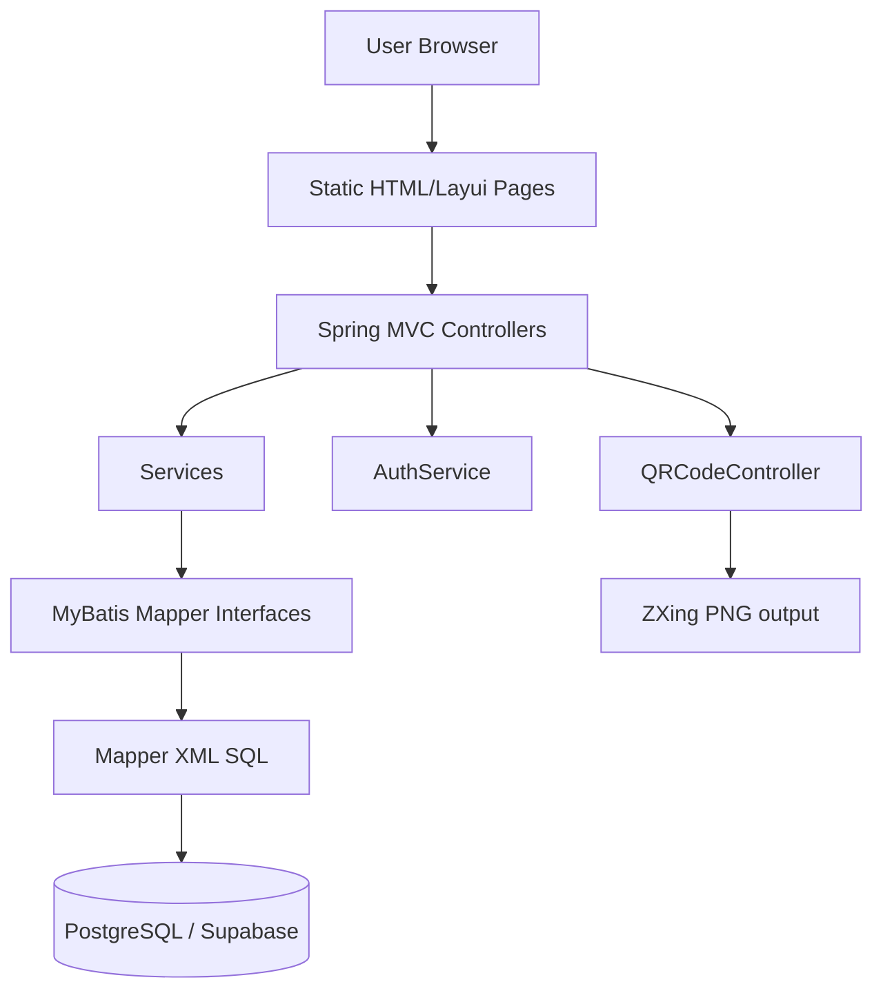

# 02 · 架构设计

本文档说明项目分层、职责边界、数据流和运行时生命周期。

## 1. 项目结构

```text
src/main/java/com/wjh/quest
├── QuestApplication.java       # Spring Boot 启动入口
├── config                       # Web/CORS 配置
├── controller                  # HTTP API
├── service                     # 业务编排
├── dao                         # MyBatis Mapper 接口
├── entity                      # 数据实体
└── utils/Result.java           # 统一返回结构

src/main/resources
├── application.yml             # 环境变量化运行配置
├── mapper                      # MyBatis XML SQL
└── static                      # Layui 静态页面
```

## 2. 分层架构



## 3. 分层职责

| 层 | 组件 | 职责 | 输入 | 输出 |
|----|------|------|------|------|
| 页面层 | `static/*.html` | 页面渲染、表单交互、发起 Ajax | 用户操作 | HTTP 请求 |
| 控制层 | `controller` | 参数接收、登录态校验、统一返回 | HTTP 请求体/参数 | `Result<T>` |
| 业务层 | `service` | 组合业务规则、事务边界、数据组装 | Java 对象/JSON | Entity/DTO |
| 数据访问层 | `dao` + `mapper` | SQL 执行和结果映射 | Mapper 参数 | 表记录 |
| 存储层 | PostgreSQL / Supabase | 持久化业务数据 | SQL | 数据结果 |

## 4. 业务流程

### 4.1 登录流程

```text
login.html
  -> POST /user/login
  -> UserController.login
  -> UserService.login
  -> UserMapper.login
  -> user table
  -> AuthService.issueToken
  -> Result<user profile + token>
```

### 4.2 创建问卷流程

```text
survey_edit.html
  -> POST /survey/edit
  -> SurveyController.edit
  -> AuthService 验证 Authorization token
  -> SurveyService.insert
  -> surveyMapper.insert
  -> questionMapper.insert
  -> optionMapper.insert
```

### 4.3 填写问卷流程

```text
answer.html
  -> GET /survey/{id}/answer
  -> SurveyController.getById
  -> QuestionService.getQuestion
  -> question + option tables
  -> render form
  -> POST /answer/add
  -> AnswerService.insert
  -> answer table
```

## 5. 数据流

| 数据 | 来源 | 转换 | 去向 |
|------|------|------|------|
| 登录表单 | `login.html` | `User` 请求体 | `user` 表查询 + token |
| 问卷结构 | `survey_edit.html` | `JSONObject fields` | `survey/question/option` 表 |
| 问卷展示 | PostgreSQL | `Survey + List<Question>` | 前端动态表单 |
| 答卷 | `answer.html` | `answers` JSON 字符串 | `answer.answer` |
| 答卷详情 | PostgreSQL | 前端 JSON.parse | Layui 弹窗表格 |

## 6. 生命周期与资源

| 资源 | 创建 | 使用 | 释放/过期 |
|------|------|------|-----------|
| Spring 应用 | `QuestApplication.main` | 服务 HTTP 请求 | 进程停止 |
| PostgreSQL 连接 | Spring datasource | Mapper SQL | 连接池管理 |
| 登录 token | 登录成功 | 后台敏感操作校验 | 默认 24 小时过期或前端退出删除 |
| 问卷数据 | 创建问卷 | 列表、编辑、填写、答卷查询 | 逻辑删除或物理删除 |

## 7. 架构边界

| 边界 | 规则 | 当前守护 | 后续可增强 |
|------|------|----------|------------|
| Controller -> Service -> Mapper | 不跳层访问数据库 | 人工 review | ArchUnit |
| 静态页面 -> HTTP API | 前端不直连存储 | 部署边界 | E2E 测试 |
| 敏感配置 | 不写死密码 | 环境变量 + `.gitignore` | CI secret scan |
| 登录态 | 后端必须校验 token | Controller 校验 | 统一拦截器 |

## 8. 已知技术债

| 问题 | 影响 | 后续建议 |
|------|------|----------|
| 明文密码 | 不适合生产 | BCrypt 哈希 + 密码迁移 |
| Controller 重复 token 校验 | 代码重复 | HandlerInterceptor 或 AOP |
| 答案 JSON 存整段文本 | 不利于统计分析 | 拆 `answer_item` 明细表 |
