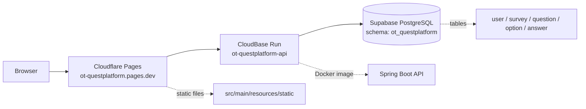

# 线上运行手册与完整功能验收

本文是 Quest Survey Platform 的线上排障、切流和验收手册。它回答三个问题：

1. 线上由哪些平台共同组成？
2. 当前为什么还没有完整跑通？
3. 怎样判断“所有核心功能已经可以流畅使用”？

## 1. 当前线上拓扑



| 平台 | 当前角色 | 固定目标 |
|------|----------|----------|
| GitHub | 保存 `quest/quest` 作为仓库根目录 | `Nemo-netone/ot-questplatform` |
| Cloudflare Pages | 托管静态 HTML/CSS/JS | `https://ot-questplatform.pages.dev` |
| CloudBase Run | 托管 Spring Boot API 容器 | `ot-questplatform-api` |
| Supabase PostgreSQL | 保存业务数据 | schema `ot_questplatform` |

## 2. 当前运行状态

最近核对时间：2026-07-07 13:15，北京时间。

| 项目 | 状态 | 证据 | 结论 |
|------|------|------|------|
| 本地代码 | 已提交并推送 | `main...origin/main` | GitHub 已包含本轮代码和文档提交 |
| GitHub 推送 | 已完成 | `git push origin main` 成功 | 远端 `main` 已更新 |
| Cloudflare Pages | 已重新发布 | Production / branch `main` / source `957aa07` | 固定地址保持 `https://ot-questplatform.pages.dev` |
| 前端 API 基址 | 已生效 | 线上 `js/app-config.js` 包含 CloudBase API 映射 | Pages 页面默认会请求 CloudBase 后端 |
| CloudBase 版本 `001` | 100% 流量，状态 normal | CloudBase version list | 当前流量仍在旧版本 |
| CloudBase 版本 `005` | 0% 流量，状态 normal | CloudBase version list | 已配置 Supabase，是目标切流版本 |
| Supabase 隔离 | 已采用独立 schema | SQL 和配置均使用 `ot_questplatform` | 不应覆盖 `public` 或其他项目数据 |

当前核心问题不是前端页面，也不是 Supabase 表隔离，而是 CloudBase Run 流量仍然指向旧版本 `001`。旧版本未注入数据库环境变量，数据库请求会回落到 `localhost:5432`，因此 `/survey/list`、登录、创建问卷、答卷查询等需要数据库的接口无法稳定工作。

当前已经验证：

- `https://ot-questplatform.pages.dev/page/login` 返回 200。
- `https://ot-questplatform.pages.dev/js/app-config.js` 已包含 `ot-questplatform.pages.dev -> CloudBase API` 映射。
- CloudBase `/api/qrcode?content=test` 返回 200。
- CloudBase `/survey/list?...` 仍返回 500。
- CloudBase 日志显示请求进入 `ot-questplatform-api-001` 容器。

## 3. 切流目标

目标状态：

| 版本 | 期望流量 | 期望状态 | 说明 |
|------|----------|----------|------|
| `ot-questplatform-api-005` | 100% | normal | 使用 Supabase 和 `ot_questplatform` schema |
| `ot-questplatform-api-001` | 0% | normal 或保留 | 临时回滚版本 |
| `ot-questplatform-api-002` | 0% | normal | 历史版本 |

控制台入口：

```text
https://tcb.cloud.tencent.com/dev?envId=meta-d5gh4ds014005aff1#/platform-run/service/detail?serverName=ot-questplatform-api&tabId=deploy&envId=meta-d5gh4ds014005aff1
```

控制台操作建议：

1. 打开 CloudBase Run 服务 `ot-questplatform-api`。
2. 进入版本/发布页面。
3. 找到 `ot-questplatform-api-005`。
4. 将 `005` 发布为全量版本，或将 `005` 调整为 100% 流量。
5. 保留 `001`，先不要删除，确认完整验收通过后再决定是否清理。

## 4. 为什么不继续用 CLI 强切

已经验证过 CLI/API 的限制：

| 尝试 | 结果 | 含义 |
|------|------|------|
| `ModifyCloudBaseRunServerFlowConf` | 返回 `ServiceNotExist` | 旧版 TCB 接口不能识别当前 CloudBase Run 服务形态 |
| `cloudrun traffic --stable 0 --canary 100` | 返回“不存在灰度中的版本或灰度版本部署未完成” | `005` 不在当前灰度发布单里 |
| `ReleaseGray` 指向 `005` | 返回服务状态异常 | 平台拒绝直接对该版本发布 |
| 线上 `/survey/list` | 500 或超时 | 当前流量没有打到 Supabase 版本 |

因此当前最稳妥的动作是在 CloudBase 控制台完成全量切流。继续用 CLI 硬切可能把旧版本重新发布，或使服务状态更混乱。

## 5. 切流后的接口验收

切到 `005` 后，按顺序执行这些检查。

### 5.1 服务可访问

```powershell
Invoke-WebRequest `
  -Uri 'https://meta-d5gh4ds014005aff1-1369167244.ap-shanghai.app.tcloudbase.com/api/qrcode?content=test' `
  -UseBasicParsing `
  -TimeoutSec 30
```

通过标准：

- HTTP 状态码为 `200`。
- 返回内容类型为图片或二进制图片响应。

### 5.2 数据库接口可访问

```powershell
Invoke-WebRequest `
  -Uri 'https://meta-d5gh4ds014005aff1-1369167244.ap-shanghai.app.tcloudbase.com/survey/list?isDelete=0&title=&page=1&pageSize=5' `
  -UseBasicParsing `
  -TimeoutSec 30
```

通过标准：

- HTTP 状态码为 `200`。
- 响应 JSON 中 `code` 为 `200`。
- `data.list` 能返回问卷列表。

如果 `/api/qrcode` 成功但 `/survey/list` 失败，问题几乎一定在数据库环境变量、Supabase 网络连接、schema 权限或表结构。

### 5.3 登录接口

```powershell
Invoke-RestMethod `
  -Method Post `
  -Uri 'https://meta-d5gh4ds014005aff1-1369167244.ap-shanghai.app.tcloudbase.com/user/login' `
  -ContentType 'application/json' `
  -Body '{"username":"admin","password":"123456"}'
```

通过标准：

- `code` 为 `200`。
- `data.token` 非空。
- `data.password` 不应返回真实密码。

## 6. 页面级完整验收

打开：

```text
https://ot-questplatform.pages.dev/page/login.html
```

按以下顺序验收：

| 编号 | 操作 | 预期结果 | 覆盖模块 |
|------|------|----------|----------|
| E2E-01 | 打开登录页 | 页面正常加载，无明显资源 404 | Cloudflare Pages |
| E2E-02 | 使用演示账号登录 | 登录成功，跳转后台首页 | `/user/login`、token |
| E2E-03 | 查看问卷列表 | 能看到示例问卷 | `/survey/list`、Supabase |
| E2E-04 | 新建问卷 | 保存成功，列表出现新问卷 | `/survey/edit`、`survey/question/option` |
| E2E-05 | 编辑未启用问卷 | 能读取详情并保存修改 | `/survey/detail`、`/survey/edit` |
| E2E-06 | 启用问卷 | 状态变为启用 | `/survey/updateStatus` |
| E2E-07 | 打开填写链接 | 能渲染题目和选项 | `/survey/detail?id=&type=answer` |
| E2E-08 | 提交答卷 | 提交成功 | `/answer/add` |
| E2E-09 | 查看答卷列表 | 能看到刚提交的答卷 | `/answer/list` |
| E2E-10 | 生成二维码 | 二维码图片正常展示 | `/api/qrcode` |
| E2E-11 | 停用问卷 | 状态变为停用 | `/survey/updateStatus` |
| E2E-12 | 删除/恢复问卷 | 未启用问卷可删除并恢复 | `/survey/remove`、`/survey/restore` |

全部通过后，才可以说“线上版本核心功能跑通”。

## 7. 常见故障判断

| 现象 | 优先判断 | 处理方向 |
|------|----------|----------|
| Pages 页面打不开 | Cloudflare Pages 发布或 DNS | 检查 Pages 项目、生产分支、发布目录 |
| 页面能打开但所有 API 失败 | `app-config.js` API 基址或 CloudBase 服务 | 检查 `QuestConfig.apiBaseUrl` 和 CloudBase 公开域名 |
| `/api/qrcode` 超时 | CloudBase 容器未正常服务 | 看 CloudBase 版本状态、实例日志、流量版本 |
| `/api/qrcode` 成功但 `/survey/list` 500 | 数据库连接或 schema | 检查 `DB_URL`、`DB_USERNAME`、`DB_PASSWORD`、`DB_SSLMODE`、`DB_SCHEMA` |
| 日志出现 `localhost:5432` | 运行版本没有数据库环境变量 | 切到 `005` 或重新发带环境变量的新版本 |
| 日志出现 relation/table 不存在 | schema 或初始化脚本未执行 | 在 Supabase 执行非破坏性初始化脚本 |
| 浏览器 CORS 报错 | 后端 CORS 未放行 Pages 域名 | 设置 `CORS_ALLOWED_ORIGINS=https://ot-questplatform.pages.dev` |
| 登录成功但后台写操作失败 | token 没携带或过期 | 检查 `Authorization: Bearer ...` 和 localStorage |

## 8. Supabase 安全边界

线上数据库操作只允许进入：

```text
ot_questplatform
```

不要在 Supabase SQL Editor 中执行这些操作：

- `DROP SCHEMA public`
- `DROP TABLE public.*`
- 不限定 schema 的 `DROP TABLE`
- `TRUNCATE` 其他项目表
- 不带 `WHERE` 的 `DELETE`

本项目推荐脚本是：

```text
docs/database/quest-platform-postgres.sql
```

该脚本不删除、不清空、不覆盖已有业务数据，只创建缺失对象并补充缺失示例数据。

## 9. GitHub 与 Cloudflare 后续发布

本地如果显示：

```text
main...origin/main [ahead 1]
```

说明本地有提交还没推送。网络恢复后执行：

```powershell
git push origin main
```

如果 Cloudflare Pages 已连接 GitHub 仓库和 `main` 分支，推送后会自动重新发布。固定地址仍然是：

```text
https://ot-questplatform.pages.dev
```

如果 GitHub 暂时推不上，也可以在 Cloudflare 控制台或 Wrangler 中直接部署 `src/main/resources/static`，但长期推荐走 GitHub -> Cloudflare Pages 自动发布。本轮已使用 Wrangler 将静态前端发布到同一个 `ot-questplatform` Pages 项目，地址保持不变。

## 10. 完成标准

可以把项目状态标记为“完整线上可用”的条件：

- [x] 最新本地提交已推送到 `origin/main`。
- [x] Cloudflare Pages 生产部署已使用本轮静态前端提交。
- [ ] CloudBase Run `ot-questplatform-api-005` 或后续等价新版本为 100% 流量。
- [ ] `/api/qrcode` 返回 200。
- [ ] `/survey/list` 返回 JSON 成功响应。
- [ ] 登录、创建问卷、启用问卷、填写问卷、提交答卷、查看答卷、二维码功能均通过。
- [ ] Supabase 业务表确认位于 `ot_questplatform` schema。
- [ ] 仓库没有提交 `.env`、token、数据库密码、云平台密钥。

这些条件全部满足后，才代表“线上版本所有核心功能都已经跑通”。
